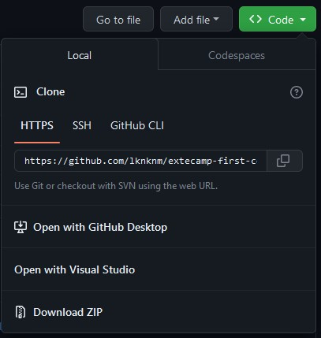
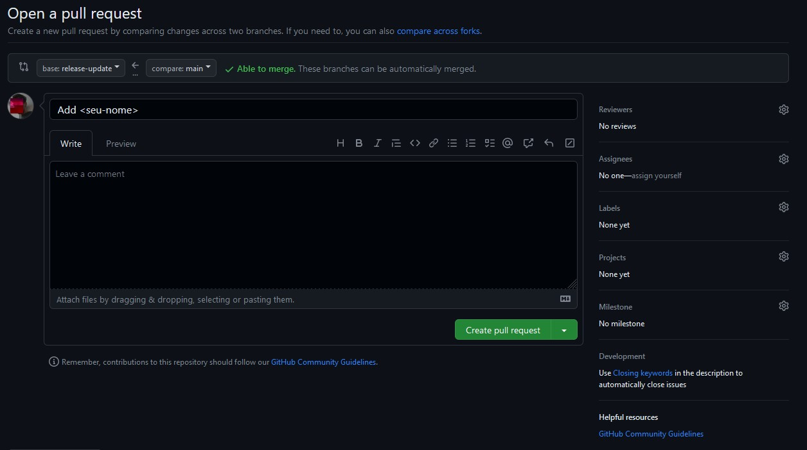
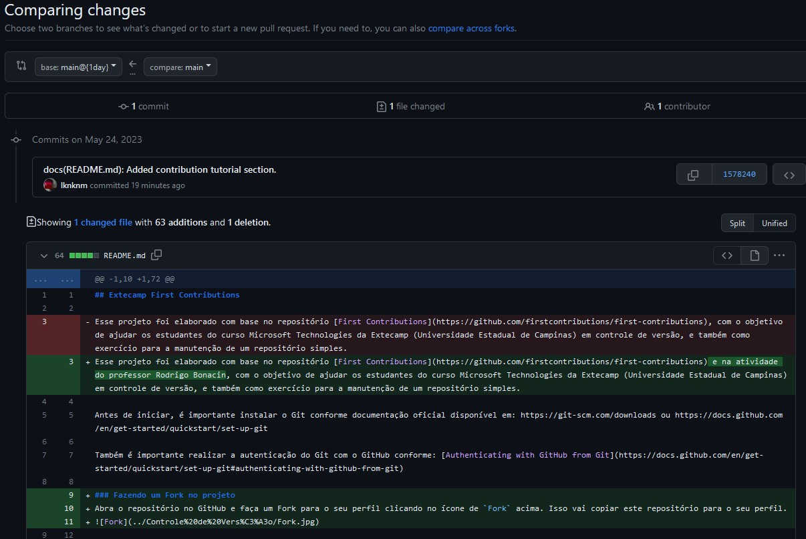

# Extecamp First Contributions


| [English translation](./translations/README_eng.md) |
|---------------------|

Esse projeto foi elaborado com base no repositório [First Contributions](https://github.com/firstcontributions/first-contributions) e na atividade do professor Rodrigo Bonacin, com o objetivo de ajudar os estudantes do curso Microsoft Technologies da Extecamp (Universidade Estadual de Campinas) em controle de versão, e também como exercício para a manutenção de um repositório simples.

Antes de iniciar, é importante instalar o Git conforme documentação oficial disponível em: https://git-scm.com/downloads ou https://docs.github.com/en/get-started/quickstart/set-up-git

Também é importante realizar a autenticação do Git com o GitHub conforme: [Authenticating with GitHub from Git](https://docs.github.com/en/get-started/quickstart/set-up-git#authenticating-with-github-from-git)

## Fazendo um Fork no projeto
Abra o repositório no GitHub e faça um Fork para o seu perfil clicando no ícone de `Fork` no canto superior direito. Isso vai copiar este repositório para o seu perfil.
<br></br>


## Clonando o Repositório


Agora você pode clonar o repositório para o seu computador local. Abra o repositório de sua conta (o Fork que você acabou de criar) e clique no dropdown `<> Code` e copie o link do seu repositório:

Após copiar a URL do código, execute o comando do Git em uma pasta de sua preferência:

```shell
git clone <url copiada>
```
Ou, alternativamente, você também pode utilizar a URL SSH do repositório:
```shell
git clone git@github.com:this-is-you/first-contributions.git
```
Onde `this-is-you` é o seu nome de usuário no GitHub.

## Criando uma branch
Entre na pasta de seu repositório utilizando o comando `cd`:
```shell
cd extecamp-first-contributions
```
Agora, crie uma Branch utilizando o comando `git switch`:
```shell
git switch -c <nome-de-sua-branch>
```
Por exemplo:
```
git switch -c add-lucas-m
```

## Criando as alterações necessárias para o deploy
Abra o arquivo `HelloProject/hello.cs` dentro do seu editor de código de preferência (VSCode, VIM, etc).
A partir do comentário `linha 21` (é importante que seja a partir da linha 21) adicione um print de Hello World onde `<seu-nome>` é o seu nome ou username, como por exemplo:

```cs
Console.WriteLine("Hello world! My name is <seu-nome>");
```
Exemplo:
```cs
Console.WriteLine("Hello world! My name is Lucas");
```
Para verificar as mudanças que você realizou, execute o comando `git status`. 
Agora, para criar um staging das suas alterações, execute o comando
```shell
git add HelloProject/hello.cs
```
E agora crie uma mensagem de commit com suas mudanças para realizar o pull request:
```shell
git commit -m "Add <seu-nome> to Extecamp Contributors"
```

## Git Push
Agora, para as alterações em seu código estarem presentes na branch `main`ou `master`, é necesário que você faça um `push` `(empurrar)` de seu código local para o repositório remoto. Para isso, vamos executar o comando:

```shell
git push -u origin <nome-de-sua-branch>
```
Onde `<nome-de-sua-branch>` é o mesmo nome da Branch que você criou mais cedo.

## Enviando suas alterações para um Pull Request
Em seu repositório do GitHub, você verá uma aba chamada `Compare & Pull Request`

Ao clicar nesse botão, você abrirá uma janela para submeter as suas alterações para o repositório original, com a comparação de linhas que você adicionou, alterou, ou arquivos que inseriu/excluiu. 



Após o pedido de pull request, será possível verificar a comparação de linhas alteradas, funções, arquivos, etc.
<br></br>


Quando seu pedido de pull request for enviado, conseguirei realizar o Merge com a branch principal (`main`) e você poderá ver seu nome no projeto. 

## Sumarizando
Agora você está mais familiar com o fluxo de trabalho no Git utilizando o GitHub como repositório remoto. Você também poderá seguir os tutoriais apresentados no [First Contributions](https://github.com/firstcontributions/first-contributions) -- que foram a fonte para embasar este tutorial -- para criar seus primeiros commits e pull requests, além de agora poder contribuir para projetos [Open Source](https://github.com/open-source)!

## License
>MIT License. You can fork, copy, use, modify, and distribute this repository without restriction.